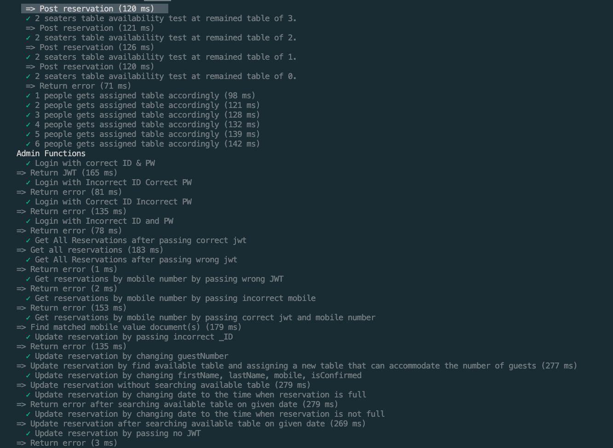

# T3A2-B

# Source code links

[Frontend](https://github.com/Henry229/T3A2-B)  
[Backend](https://github.com/lmh4686/MERN-Restaurant-API)

# R1 At a minimum use the following technologies MongoDB, Express, React, and Node

Our project is using MERN Stack that is stands for `MongoDB`, `Express`, `Reactjs`, and `Nodejs`. It is a popular web development stack used to build modern web applications. We use Reactjs for frontend development. Backend development is done by MongoDB, Express, and Nodejs.

- `MongoDB` is a NoSQL document-oriented database that is used to store booking data, customer's information, and table data.
- `Express` is a popular back-end framework for Node.js. We are using this in our application when implementing routing and middleware.
- `React` The frontend of our application is made of reactjs, one of the JavaScript libraries.
- `Node.js` is a JavaScript runtime environment that is used to build server-side applications.

Our team made a restaurant reservation application using the above four technologies.The use of these technologies also ensures that the application can handle large amounts of data and can be scaled to meet growing user demands.

# R2 Write well designed code that:

## Modulization

By separating the program into modules, each module can be developed and maintained independently, making it easier to understand and modify the code. It also helps to prevent code duplication and reduces the coupling between different parts of the program, making it easier to test and debug. The `front end` consists of an application by dividing the landing page, customer reservation, restaurant information, and manager pages into modules for each component, communication, and third-party operation. The `backend` consists of modules for router management, functions for implementing functions of each router, and database.

## DRY

For `DRY`, the entire structure of the application was divided into header, body, and footer components, and repetition was avoided by reusing the above components according to each page using a router. In the admin section for reservation management, the same functions as reservation customer management by phone number, management by date, and overall reservation management function were made into components, and these components were called from each screen to reduce repetition and increase efficiency. The backend is divided into modules necessary for table management, reservation customer information management, JWT and auth management modules, and DB-related modules, and each api route uses them, so DRY is being performed.

## Used libraries

## Frontend

### date-fns, react-datepicker

date-fns and react-datepicker have been used to create a calendar interface to display the calendar and let users to select a date and time.

date-fns is a library that allow developers to easily manipulate date objects.  
It provides more than 200 functions to manipulate date objects.  
One of the most basic usage is formatting a date object and sort ascendant order:

```js
import { format, compareAsc } from 'date-fns';

format(new Date(2023, 11, 05), 'MM/dd/yyyy');
//Create date and format => '11/05/2023'

const dates = [
  new Date(2022, 6, 2),
  new Date(2020, 1, 11),
  new Date(2021, 6, 10),
];
dates.sort(compareAsc);

//[
//   Wed Feb 11 2020 00:00:00,
//   Mon Jul 10 2021 00:00:00,
//   Sun Jul 02 2022 00:00:00
// ]
```

In this project, it was mostly used to configure the calendar from the react-date picker.

```jsx
import DatePicker from 'react-datepicker';
import 'react-datepicker/dist/react-datepicker.css';
import { addDays, subDays, setHours, setMinutes } from 'date-fns';

import React from 'react';

const Calendar = ({ date, setDate, updateDate }) => {
  const filterPassedTime = (time) => {
    const currentDate = new Date();
    const selectedDate = new Date(time);
    return currentDate.getTime() < selectedDate.getTime();
  };

  const executeChange = (dt) => {
    setDate(dt);
    updateDate && updateDate(dt);
  };

  return (
    <DatePicker
      name='date'
      id='date'
      className='bookingForm'
      placeholderText='Select date'
      selected={date} //selected date by default
      onChange={(dt) => executeChange(dt)}
      // Only dates between the start date to end date are able to be selected.
      // From today's dates to + 30 days are able to select.
      includeDateIntervals={[
        { start: subDays(new Date(), 1), end: addDays(new Date(), 30) },
      ]}
      //Configure format to display dates and times
      format='yyyy-MM-dd'
      timeFormat='p'
      dateFormat='Pp'
      //Includes time in the calendar
      //Default interval is 30 minutes.
      showTimeSelect
      //Disable past time.
      filterTime={filterPassedTime}
      //Disable manipulate calender with keyboard.
      disabledKeyboardNavigation
      //Disable all time before 11am
      minTime={setHours(setMinutes(new Date(), 0), 11)}
      //Disable all time after 8:30pm
      maxTime={setHours(setMinutes(new Date(), 30), 20)}
      excludeTimes={[
        //Excludes times from 14:30 to 16:30
        setHours(setMinutes(new Date(), 30), 14),
        setHours(setMinutes(new Date(), 0), 15),
        setHours(setMinutes(new Date(), 30), 15),
        setHours(setMinutes(new Date(), 0), 16),
        setHours(setMinutes(new Date(), 30), 16),
      ]}
    />
  );
};
export default Calendar;
```

Result:

At 01/Feb/2023 16:16

All past times are disabled.


And when date is selected, all configured times are shown.


### google-map-react

google-map-react allows developers to attach a Google map on the web site.

```js
import React from 'react';
import GoogleMapReact from 'google-map-react';
import './map.css';

//Define a marker on the map
const Marker = ({ marker }) => (
  <span id='marker' className='material-symbols-outlined'>
    {marker}
  </span>
);

//The api key can be issued from the google project.
const googleApiKey = import.meta.env.VITE_REACT_APP_GOOGLE_API_KEY;

//Define a marker on the map
const Marker = ({ marker }) => (
  <span id='marker' className='material-symbols-outlined'>
    {marker}
  </span>
);

//The api key can be issued from the google project.
const googleApiKey = import.meta.env.VITE_REACT_APP_GOOGLE_API_KEY;

export default function Map() {
  const defaultProps = {
    //positioning the map.
    center: {
      lat: -33.85672,
      lng: 151.21529,
    },
    //zoom level
    zoom: 13,
  };

  return (
    // Always set the container height explicitly
    <section id='map'>
      //Link google map
      <link
        rel='stylesheet'
        href='https://fonts.googleapis.com/css2?family=Material+Symbols+Outlined:opsz,wght,FILL,GRAD@48,300,0,0'
      />
      //Configurations defined above
      <GoogleMapReact
        bootstrapURLKeys={{ key: googleApiKey }}
        defaultCenter={defaultProps.center}
        defaultZoom={defaultProps.zoom}
      >
        // Display marker
        <Marker lat={-33.85672} lng={151.21529} marker='location_on' />
      </GoogleMapReact>
    </section>
  );
}
```

### tailwindcss

Tailwind CSS is a utility-first CSS framework for rapidly building custom user interfaces. It provides a set of pre-designed CSS classes that can be combined to style HTML elements quickly and easily, without having to write custom CSS styles. The framework is designed to be highly customizable, allowing developers to fine-tune the design of their user interfaces by adjusting values in the framework's configuration file. This can save time compared to writing CSS from scratch, and makes it easier to create consistent and responsive designs across different devices and screen sizes. The example of `tailwindcss` is below.

```js
<input className='my-2 py-1 pl-3 text-gray-800 text-lg bg-blue-100 rounded-md border-0 outline-0' />
```

### base-64

Base64 is a way to represent binary data, such as images or audio files, as text. It works by encoding binary data as ASCII characters, which can then be transmitted or stored as text. The encoding process transforms each set of three bytes of binary data into four characters, using a specific mapping of 64 characters that includes the digits 0-9, the uppercase and lowercase letters, and some special characters.

### react-icons

React-icons is a library of commonly used icons, implemented as React components, for use in React applications. It provides a large collection of icons from various popular icon sets, such as Font Awesome, Material Design Icons, and many others. These icons can be easily included in React components and styled using the properties and methods provided by React. The library makes it simple to add icons to a React application, reducing the need for custom icon implementation and allowing for quicker development.

```js
import { FaTrashAlt } from 'react-icons/fa';
<button>
  <FaTrashAlt />
</button>;
```

## Backend

### Express

Express is a free open-source web framework for Node.js. It is minimal and flexible and used to build web applications and APIs. By using Express, developers can easily create a server that receives requests from clients and responds correspondingly with pre-defined functions. A server built with Express responds in the following sequence:

1. Receive a request from a client.
2. The server checks for a matching HTTP method and URL that is requested from the client.
3. Runs all functions that are called by the router or have matching HTTP method and URL one-by-one from top to bottom until it sends a response back to the client.

Middleware In Express

In number 3, ‘all functions’ are called ‘middlewares’ in Express. They are functions that are executed before it sends a response. Developers can define them for error-handling, validation, calculation, database query, etc. Also Express has some built-in middlewares, for example, ‘express.json()’ parses JSON requests and returns parsed data to request so developers can access and manipulate the request object using dot notation.

```js
import express from 'express';
import reservationRoutes from './controllers/ReservationRoutes.js';

const app = express();

app.get('/', (req, res) => {
  res.json({ msg: 'Restaurant booking API' });
});

app.use('/reservation', reservationRoutes);

app.listen(process.env.PORT || 3000, () => console.log('API Connected'));
```

The code snippet above shows basic usage of express. Firstly, it makes an instance of express and define response by endpoints and HTTP verbs. And app.use() method lets the 'app' uses the given middleware. In this case, the reservationRoutes is imported from other file, and it prefixes a part of url to be '/reservation'. So all url starts with '/reservation', will be passed to the 'reservationRoutes' middleware which looks like this:

```js
import express from 'express';

const router = express.Router();

router.get('/', verifyJwt, generateAdminJWT, async (req, res) => {
  const reservations = await Reservation.find().populate(populateOption);
  reservations.sort((a, b) => a.guest.date - b.guest.date);

  reservations.length
    ? res.json({ jwt: req.jwt, reservations })
    : res.status(404).json(notFoundMsg);
});

export default router;

export async function hashString(stringToHash) {
  let salt = await bcrypt.genSalt(saltRounds);
  return await bcrypt.hash(stringToHash, salt);
}

export async function validateHashedData(unhashedData, hashedData) {
  return await bcrypt.compare(unhashedData, hashedData);
}
```

The 'slatRound' specifies the number of iterations to use when generating a salt for login credential hash. And it also determines the time to compute the salt ans hash. The larger the number is, the longer it takes and the more secure. Therefore, all salt and hash related methods are asynchronous.

The 'bcrypt.genSalt(saltRounds)' apply the defined 'slatRounds' and generate the salt. And the 'bcrypt.hash(stringToHash, salt)' add the salt to the given string and hash it.

Unlike encryption, once data is hashed, it is impossible to unhash the data. However, it provides a method to compare a unhashed data and hashed data. If the original data is the same, the 'bcrypt.compare(unhashedData, hashedData)' method will return true. Otherwise, it will return false.

### cors

Cors is used to prevent the cross-origin error. The cross-origin error is one of the security restriction by web browsers which blocks sending requests to other do
s. This policy is 'Same Origin Policy' and is implemented by default to prevent malicious scripts from accessing sensitive information from other websites. To undo this policy, we should change the policy to be 'Cross-origin Resource Sharing' which allows to make request to any other origins. And the library 'cors' can implement this policy by simply including this code `app.use(cors())` between the express instance(app) and the firstly defined route.

### dotenv

dotenv is used to safely store the environment variables. It is useful to save sensitive information such as API keys, JWT secrete, database url, etc. By saving them in the .env file, developers can conceal the sensitive information from the source code.  
To access the environment variables,

1. Import dotenv
2. Call `dotenv.config()`
3. Write `process.env.[variableName]` to access an environment variable.

`dotenv.config()` reads the .env file, parse the contents, assign it to `process.env` and return an Object that contains ket, value pairs of the environment variables.

In this project, it has been used to store:

1. Enc key and ENC IV for encryption configuration
2. JWT secret key
3. Database URL
4. Admin login credentials

### helmet

Helmet is a node JS library that is used to improve security by setting various HTTP headers.

```js
app.use(helmet());
app.use(helmet.permittedCrossDomainPolicies());
app.use(helmet.referrerPolicy());
app.use(
  helmet.contentSecurityPolicy({
    directives: {
      defaultSrc: ["'self'"],
    },
  })
);
```

The top level `app.use(helmet())` is a middleware that wraps around 15 smaller middlewares that all improve headers' security. And the developers can use other middleware configurations as above.

### jsonwebtoken

JWT is one of the popular user authentication methods and the library jsonwebtoken provides various JWT related functions. In this project, the jsonwebtoken library has been used to generate JWT and verify JWT.

```js
import jwt from 'jsonwebtoken';

jwt.sign({ username: 'foo', password: 'bar' }, jwtSecret, { expiresIn: '1d' });
jwt.verify(targetJWT, jwtSecret, { complete: true });
```

The jwt.sign() method creates a new JWT. We can pass three arguments, an object, JWT secret key and expiry time. Then it will return a new JWT that based on the given arguments.

The jwt.verify() method verifies if the given JWT has the same secret key value. And because of the optional argument '{complete: true}', it will returns a complete object that contains payload, header and signature. Because it only checks if the JWT secret key is valid, we should check if the login credentials are valid manually. To read the login credentials, we can use payload.data which returns stringified login credentials (usually encrypted as well). Then we can use JSON.parse() to convert it to a JavaScript object and compare the values with the original values.

### mongoose

mongoose is an ODM (Object Data Modeling) that provides a connection between the mongoDB and the server. By using mongoose, developers can create read and manipulate data. The following will show some of usages of mongoose in the project.

**Creating a model**

```js
import mongoose from 'mongoose';

const GuestSchema = mongoose.Schema({
  firstName: { type: String, required: true },
  lastName: { type: String, required: true },
  mobile: { type: String, required: true },
  date: { type: Date, required: true },
  guestNumber: { type: Number, required: true },
});

const ReservationSchema = mongoose.Schema({
  table: { type: mongoose.Types.ObjectId, ref: 'Table', required: true },
  guest: GuestSchema,
  isConfirmed: { type: Boolean, default: false },
});

const Reservation = mongoose.model('Reservation', ReservationSchema);
```

The mongoose.Schema() method is used to define a structure of a collection. Developers can specify the data type in each field and some conditions such as mandatory required or default values.  
The GuestSchema is nested inside of the ReservationSchema. This form is called 'sub document'. The sub document can only exist inside of the parent document and it will be assigned its own unique \_id value when it's created as if other normal documents. There's an other way to reference other document as well. In the ReservationSchema, table field, it references the table ID by specifying the type as an object id and where it comes from. However, this way will not generate the unique ID for the field.

On the last line, `const Reservation = mongoose.model("Reservation", ReservationSchema)` will create a new model called Reservation that has the structure of the ReservationSchema. Then the model is accessible by calling `Reservation`.

**Query**

```js
const dateFilteredReservations = await Reservation.find({
  'guest.date': {
    $lt: manipulateHours(bookingInfo.date, 'plus', 4),
    $gt: manipulateHours(bookingInfo.date, 'minus', 4),
  },
}).populate('table');
```

The `Model.find()` method returns an array of the all documents that belong to the Model. However, we can filter the results by passing some conditions. The 'guest.date' is the target value to filter, the "\$lt" means 'less than', '\$gt' means 'greater than' and the 'manipulateHours' is a custom function that add or subtract the given hours value to the given date. So it will return all documents that have the 'guest.date' values are from 'bookingInfo.date' - 4hr to 'bookingInfo.date + 4hr'. And the '.populate('table')' will show all the table document's fields instead of only showing its id. On the other hand, `Model.findOne()` will return the first document that it's found and `Model.findById(idValue)` will find a document that have the given id. All database queries happen asynchronously so it's important to use await keyword when it's necessary.

```js
const newBooking = await Reservation.create({
  table: req.availableTableId,
  guest: req.body,
});
```

`Model.create()` method will insert a new document into the collection. If the argument does not match with its schema, it won't be created. It will return the created document by default.

```js
const updatedReservation = await Reservation.findByIdAndUpdate(
  req.params.id,
  {
    table: req.availableTableId,
    guest: req.updatedGuestForm,
    isConfirmed: Boolean(req.updatedGuestForm.isConfirmed),
  },
  { returnDocument: 'after' }
);
```

`Model.findByIdAndUpdate()` method will find the document whose id is the same as the given id argument and update it with the given fields. The optional third argument '{returnDocument: 'after'}' will return the updated document instead of the original document. And `Model.findByIdAndDelete()` works same as this method but it doesn't require any fields to be provided, it will search the document that has the given id and delete the corresponding document.

### jest, supertest

Jest is one of the most popular JavaScript testing frameworks. And supertest lets developers to send requests to the server and able to access the response object in test scripts.

The following code snippet will show the usage of jest and supertest.

```js
import request from 'supertest';
import app from '../index.js';

describe('POST Reservation', () => {
  for (let testCase of sameCustomerFilterTestCases) {
    test(testCase.condition, async () => {
      const res = await request(app).post('/reservation').send(testCase.guest);
      expect(res.statusCode).toBe(testCase.expectedStatus);

      if (testCase.expectedStatus === 201) {
        expect(res.statusCode).toBe(201);
        expect(new Date(res.body.guest.date).toLocaleString()).toEqual(
          new Date(testCase.guest.date).toLocaleString()
        );
        expect(res.body.guest).toEqual(testCase.guest);
      } else {
        expect(res.statusCode).toBe(409);
        expect(res.body.error).toBe('Same guest found!');
        expect(Object.keys(res.body).length).toEqual(1);
      }
    });
  }
});
```

describe('Testing category') method group tests by the given category. Then it uses callback function to call test() method execute the test. The first argument of the test method should specify the test condition and the expected outcome. And the following callback function will perform the test.  
A request can be sent to the server as follows:  
`const response = await request([imported app]).[httpVerb]([url]).set([headers]).send([body])`  
Then, this will return the response from the server and developers can check if the response is as expected:  
`expect([res.body.someValue]).toBe(expectedValue)`  
If the 'some value' is not 'expected value', the test will fail. If it's the same, it will move to the next.  
The 'expect' argument no need to be specific. For example, we can use Boolean operator as well:  
`expect(res.body.someValue > 5).toBe(true)`  
To check if a specific field is in the response body, we can use 'toBeDefined()' method. It is useful to check if a specific field is included in the response body that has unpredictable value such as JWT:  
`expect(res.body.jwt).toBeDefined()`
And it also can access the response status code by calling `response.statusCode`.

## Code Flow Control

By breaking down the user story, we planned how to do error handling, branching, and iteration according to the `Agile` methodology, and based on this, `Dataflow diagram`, `Application Architecture Diagram`, and `WireFrame` were created in the design stage. In the implementation stage, it was implemented with a focus on preventing redundancy and increasing reusability according to the design, and the implemented sources were tested to see if they fit the test cases and checkpoints and whether the functions worked properly.

## Object Oriented Principals

Implementing components and functions in JavaScript itself is the application of the OOP concept.

# R3 Employ and utilise proper source control methodology (git)

---

Collaboration via github was essential as our project team is geographically separated.

```
Create Branch --> Code & Test --> git add. --> git commit -> git push -> merge in github --> Create pull request --> Pull request --> Merge pull request --> Confirm merge
```

Coding and testing were done while repeating the above cycle.

`git branch` command to create new branches for your project. This allows you to work on multiple features or bug fixes at the same time, without affecting the main branch.

`Use a branching strategy`: Choose a branching strategy that works best for your project, such as Gitflow or Feature Branching.

`git push` command to push your changes to a remote repository

`git pull` command to retrieve changes made by other team members from the remote repository.

`git merge` command to merge changes from one branch into another.

By following these steps, you can effectively manage your code using Git source control methodology, which allows for collaboration, versioning, and backup of your code.


For more details, you can see the use of multiple feature branches and commits, merges, and pull requests between team members by looking at the `.gitignore` and `git log` of the source.

## R4. Demonstrate your ability to work in a team

## Use a recognised project management methodology

## Testing

### Development Testing

#### < **Frontend** >

#### < **Backend** >

The automated test has been fully covered all possible cases.  
Please check [src/test/](https://github.com/lmh4686/MERN-Restaurant-API/tree/main/src/test) directory for more details.

**Automated test cases and outcomes**




### Production Testing

#### < **Frontend** >

**-Website-**

| CheckList                                      | Pass |
| ---------------------------------------------- | ---- |
| Admin pages are protected                      | P    |
| All url works as expected                      | P    |
| No unexpected error found                      | P    |
| All pages communicate with API without problem | P    |
| Load pages in reasonable time                  | P    |
| Accessible from other devices                  | P    |

**-Header-**

| CheckList                                                          | Pass |
| ------------------------------------------------------------------ | ---- |
| All components loaded correctly                                    | P    |
| Fully responsive                                                   | P    |
| Header stay on the top on all pages                                | P    |
| Nav to landing page when the title is clicked                      | P    |
| Nav to corresponding web pages when nav bar components are clicked | P    |

**-Footer-**

| CheckList                                          | Pass |
| -------------------------------------------------- | ---- |
| All components loaded correctly                    | P    |
| Fully responsive                                   | P    |
| Footer stays on the bottom on all pages            | P    |
| Modal boxes appear on click of corresponding icons | P    |
| Link icons work as intended                        | P    |

**-Home Page-**

| CheckList                       | Pass |
| ------------------------------- | ---- |
| All components loaded correctly | P    |
| Fully responsive                | P    |
| Images changes on click         | P    |
| Icons work as intended          | P    |
| Images are well sized           | P    |

**-Admin Login Page-**

| CheckList                                              | Pass |
| ------------------------------------------------------ | ---- |
| All components loaded correctly                        | P    |
| Fully responsive                                       | P    |
| Popup error message when ID is incorrect               | P    |
| Popup error message when password is incorrect         | P    |
| Navigate to the admin page when successfully logged in | P    |

**-Admin Page-**

| CheckList                                                                              | Pass |
| -------------------------------------------------------------------------------------- | ---- |
| All components loaded correctly                                                        | P    |
| Fully responsive                                                                       | P    |
| Display update popup on click of one reservation                                       | P    |
| Update popup loads reservation details on click of one reservation                     | P    |
| Successfully search customer by mobile number                                          | P    |
| Successfully update customer details                                                   | P    |
| Successfully delete customer details                                                   | P    |
| Dropdown menu displays all dates of reservations                                       | P    |
| Dropdown menu shows only corresponding reservations on click                           | P    |
| Relocate the reservation on click of checkbox                                          | P    |
| Reservations correctly grouped by confirmed/unconfirmed                                | P    |
| Reservations correctly grouped by confirmed/unconfirmed                                | P    |
| Correctly displays error popup message when there's no available table found on update | P    |
| Validation works for all inputs                                                        | P    |
| Validation works for all inputs                                                        | P    |

**-Rservation Page-**

| CheckList                                                               | Pass |
| ----------------------------------------------------------------------- | ---- |
| All components loaded correctly                                         | P    |
| Fully responsive                                                        | P    |
| Validator works for all inputs and display popup message accordingly    | P    |
| Displays popup message when booking is successfully made                | P    |
| Displays popup message when booing is failed when there's no table left | P    |
| Calender displays only available dates and times correctly              | P    |

**-About Us Page-**

| CheckList                         | Pass |
| --------------------------------- | ---- |
| All components loaded correctly   | P    |
| Fully responsive                  | P    |
| Map shows exact location          | P    |
| Map is pinned by Marker correctly | P    |

#### < **Backend** >

| CheckList                                                           | Pass |
| ------------------------------------------------------------------- | ---- |
| Deployed successfully                                               | P    |
| All routers responses accordingly based on the test done from the f | P    |

=======
| CheckList | Pass |
| ---------------------------------------------- | ---- |
| Admin pages are protected | P |
| All url works as expected | P |
| No unexpected error found | P |
| All pages communicate with API without problem | P |
| Load pages in reasonable time | P |
| Accessible from other devices | P |

**-Header-**

| CheckList                                                          | Pass |
| ------------------------------------------------------------------ | ---- |
| All components loaded correctly                                    | P    |
| Fully responsive                                                   | P    |
| Header stay on the top on all pages                                | P    |
| Nav to landing page when the title is clicked                      | P    |
| Nav to corresponding web pages when nav bar components are clicked | P    |

**-Footer-**

| CheckList                                          | Pass |
| -------------------------------------------------- | ---- |
| All components loaded correctly                    | P    |
| Fully responsive                                   | P    |
| Footer stays on the bottom on all pages            | P    |
| Modal boxes appear on click of corresponding icons | P    |
| Link icons work as intended                        | P    |

**-Home Page-**

| CheckList                       | Pass |
| ------------------------------- | ---- |
| All components loaded correctly | P    |
| Fully responsive                | P    |
| Images changes on click         | P    |
| Icons work as intended          | P    |
| Images are well sized           | P    |

**-Admin Login Page-**

| CheckList                                              | Pass |
| ------------------------------------------------------ | ---- |
| All components loaded correctly                        | P    |
| Fully responsive                                       | P    |
| Popup error message when ID is incorrect               | P    |
| Popup error message when password is incorrect         | P    |
| Navigate to the admin page when successfully logged in | P    |

**-Admin Page-**

| CheckList                                                                              | Pass |
| -------------------------------------------------------------------------------------- | ---- |
| All components loaded correctly                                                        | P    |
| Fully responsive                                                                       | P    |
| Display update popup on click of one reservation                                       | P    |
| Update popup loads reservation details on click of one reservation                     | P    |
| Successfully search customer by mobile number                                          | P    |
| Successfully update customer details                                                   | P    |
| Successfully delete customer details                                                   | P    |
| Dropdown menu displays all dates of reservations                                       | P    |
| Dropdown menu shows only corresponding reservations on click                           | P    |
| Relocate the reservation on click of checkbox                                          | P    |
| Reservations correctly grouped by confirmed/unconfirmed                                | P    |
| Reservations correctly grouped by confirmed/unconfirmed                                | P    |
| Correctly displays error popup message when there's no available table found on update | P    |
| Validation works for all inputs                                                        | P    |
| Validation works for all inputs                                                        | P    |

**-Rservation Page-**

| CheckList                                                               | Pass |
| ----------------------------------------------------------------------- | ---- |
| All components loaded correctly                                         | P    |
| Fully responsive                                                        | P    |
| Validator works for all inputs and display popup message accordingly    | P    |
| Displays popup message when booking is successfully made                | P    |
| Displays popup message when booing is failed when there's no table left | P    |
| Calender displays only available dates and times correctly              | P    |

**-About Us Page-**

| CheckList                         | Pass |
| --------------------------------- | ---- |
| All components loaded correctly   | P    |
| Fully responsive                  | P    |
| Map shows exact location          | P    |
| Map is pinned by Marker correctly | P    |

#### < **Backend** >

| CheckList                                                           | Pass |
| ------------------------------------------------------------------- | ---- |
| Deployed successfully                                               | P    |
| All routers responses accordingly based on the test done from the f | P    |
